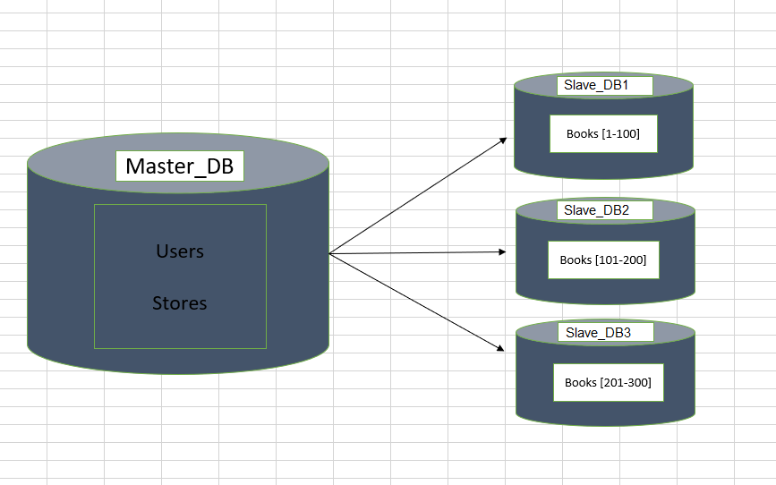
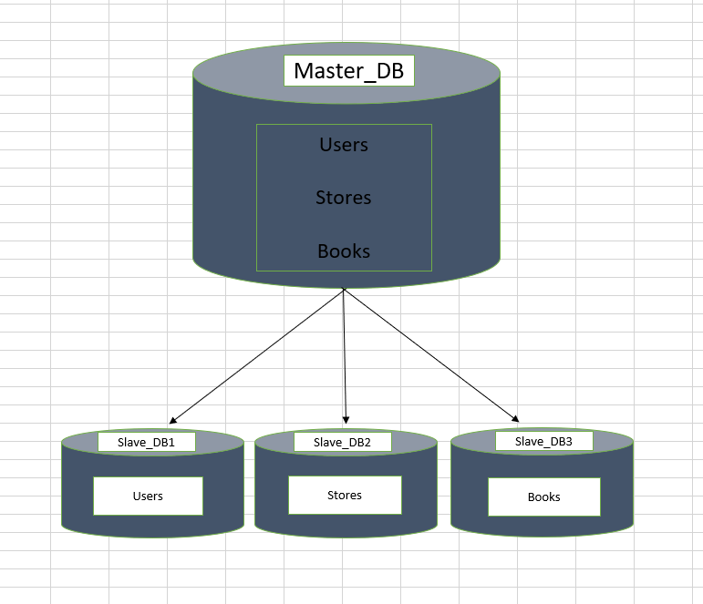

# Домашнее задание к занятию «Репликация и масштабирование. Часть 2.»

---

## Задание 1

### Опишите основные преимущества использования масштабирования методами:

- активный master-сервер и пассивный репликационный slave-сервер;

- master-сервер и несколько slave-серверов;

---

## РЕШЕНИЕ:

### Преимущества масштабирования:

1. Активный master-сервер и пассивный slave-сервер

Отказоустойчивость: если master выходит из строя, slave может быть переведён в режим master.

Распределение нагрузки чтения: запросы на чтение можно перенаправлять на slave, снижая нагрузку на master.

Резервное копирование: на slave можно выполнять backup снижения производительности master.

Тестирование и аналитика: slave можно использовать для тестирования обновлений или выполнения аналитических запросов без нагрузки на master.

2. Master-сервер и несколько slave-серверов

Масштабируемость чтения: запросы на чтение распределяются между несколькими slave-серверами, что позволяет обслуживать больше пользователей.

Геораспределение: slave-серверы можно размещать в разных регионах для уменьшения задержки.

Отказоустойчивость: при выходе из работы одного slave остальные продолжают работать.

Разделение задач: разные slave можно использовать для разных целей.

---

## Задание 2

### Разработайте план для выполнения горизонтального и вертикального шаринга базы данных. База данных состоит из трёх таблиц:

- пользователи,

- книги,

- магазины (столбцы произвольно).

### Опишите принципы построения системы и их разграничение или разбивку между базами данных. Пришлите блоксхему, где и что будет располагаться. Опишите, в каких режимах будут работать сервера.

---

### РЕШЕНИЕ:

### Горизонтальный шардинг.

**Принцип:** Разделение одной таблицы на части (шарды) по определённому ключу.

### **Схема:**
#### **a) Шардинг по пользователям (`users`)**
- **Критерий:** `user_id % 3` (разделение на 3 шарда)
- **Сервер 1 (Master)**:
  - `users` (основные данные пользователей)
  - `stores` (информация о магазинах)
  - **Режим:** `Read-Write` (записи и чтение)
- **Сервер 2 (Slave)**: `users` (id % 3 = 0)
  - **Режим:** `Read-Only` (записи и чтение)
- **Сервер 3 (Slave)**: `users` (id % 3 = 1)
  - **Режим:** `Read-Only` (записи и чтение)
- **Сервер 4 (Slave)**: `users` (id % 3 = 2)
  - **Режим:** `Read-Only` (записи и чтение)

#### **b) Шардинг по магазинам (`books`)**
- **Критерий:** `store_id` (книги распределяются по серверам в зависимости от магазина)
- **Сервер 1 (Master)**:
  - `users` (основные данные пользователей)
  - `stores` (информация о магазинах)
  - **Режим:** `Read-Write` (записи и чтение)
- **Сервер 2 (Slave)**: `books` (store_id = 1, 4, 7...)
  - **Режим:** `Read-Only` (записи и чтение)
- **Сервер 3 (Slave)**: `books` (store_id = 2, 5, 8...)
  - **Режим:** `Read-Only` (записи и чтение)
- **Сервер 4 (Slave)**: `books` (store_id = 3, 6, 9...)
  - **Режим:** `Read-Only` (записи и чтение)

**Обоснование:**
- Распределение нагрузки по пользователям и магазинам.
- Уменьшение конкуренции за ресурсы при высокой нагрузке.

### Вертикальный шардинг.

**Принцип:** Разделение таблиц по функциональности между разными серверами.

### **Схема:**
- **Сервер 1 (Master)**:
  - `users` (основные данные пользователей)
  - `stores` (информация о магазинах)
  - `books` (информация о книгах)
  - **Режим:** `Read-Write` (записи и чтение)

- **Сервер 2 (Slave)**:
  - `users` (данные о пользователях)
  - **Режим:** `Read-Only` (масштабирование чтения)

- **Сервер 2 (Slave)**:
  - `stores` (данные о магазинах)
  - **Режим:** `Read-Only` (масштабирование чтения)

- **Сервер 2 (Slave)**:
  - `books` (каталог книг)
  - **Режим:** `Read-Only` (масштабирование чтения)

**Обоснование:**
- Таблицы `users` и `stores` часто обновляются (регистрация, изменения данных).
- Таблица `books` чаще читается (поиск книг), реже обновляется (добавление новых книг).

